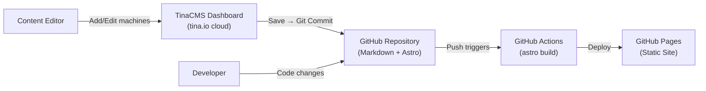
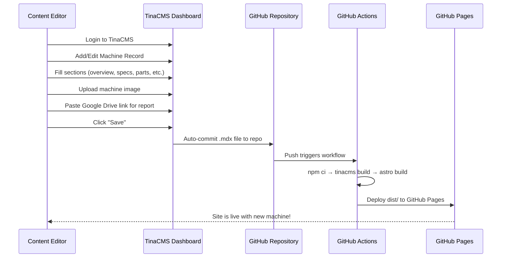

# Southern Machines — Factory Machine Database Website

Build a premium, static factory machine database website using **Astro** + **TinaCMS** (headless CMS), deployed to **GitHub Pages**. Content editors can add/edit machine records from TinaCMS dashboard; every save auto-commits to GitHub → triggers rebuild → live site updates automatically.

---

## User Review Required

> [!IMPORTANT]
> **CMS Choice: TinaCMS (recommended) vs Decap CMS**
> - **TinaCMS** is recommended because: Git-based (content lives as Markdown in your repo), free tier with TinaCloud handles auth, visual editing UI, auto-commits to GitHub on save → triggers rebuild → GitHub Pages auto-updates. No external OAuth server needed.
> - **Decap CMS** is an alternative but requires setting up your own OAuth server for GitHub Pages (friction point).
> - Please confirm you're okay with **TinaCMS**.

> [!IMPORTANT]
> **Google Drive Download Link**
> - Each machine's "Download Report" button will link to a Google Drive URL you provide in the CMS.
> - The CMS will have a field called `reportDownloadUrl` where you paste the Google Drive sharing link.

> [!WARNING]
> **TinaCloud Account Required**
> - You'll need a free [TinaCloud](https://tina.io/) account to enable the cloud-hosted CMS dashboard.
> - During development, you can use TinaCMS in local mode (no account needed).
> - For production CMS access, you'll need to add `TINA_PUBLIC_CLIENT_ID` and `TINA_TOKEN` as GitHub Secrets.

---

## Open Questions

> [!IMPORTANT]
> 1. **Site Name**: Should the site be called "Southern Machines" or "TechFactory Database" (from the design reference)?
> 2. **Repository Name**: What will the GitHub repo be called? This affects the `base` path for GitHub Pages (e.g., `https://username.github.io/southern-machines/`).
> 3. **Machine Images**: Will you upload machine images through the CMS, or do you already have them hosted somewhere (like Google Drive)?
> 4. **How many machines** do you currently have data for? (Just to understand initial content volume)
> 5. **Do you want dark mode** toggle support? The design reference has dark mode tokens defined.

---

## Architecture Overview



### Tech Stack

| Layer | Technology | Purpose |
|-------|-----------|---------|
| **Framework** | Astro 5.x | Static site generation, content collections |
| **CMS** | TinaCMS + TinaCloud | Headless CMS, visual editing, Git-based storage |
| **Styling** | Tailwind CSS v3 | Utility-first CSS matching design reference tokens |
| **Fonts** | Hanken Grotesk, Inter, JetBrains Mono | From design reference |
| **Icons** | Material Symbols Outlined | From design reference |
| **Deploy** | GitHub Pages + GitHub Actions | Free static hosting |

---

## Proposed Changes

### 1. Project Initialization

#### [NEW] Astro Project Setup

Initialize Astro project in the `d:\Southern_Machines` directory:
- `npm create astro@latest ./` (empty template)
- Install dependencies: `@astrojs/tailwind`, `tinacms`, `@tinacms/cli`
- Configure `astro.config.mjs` with site URL, base path, and Tailwind integration

---

### 2. Design System (from design.md reference)

#### [NEW] [tailwind.config.mjs](file:///d:/Southern_Machines/tailwind.config.mjs)

Extract the complete Material Design 3 color system and typography tokens from the design reference:
- **Colors**: `primary`, `secondary`, `surface-*`, `on-*`, `outline-*`, `error-*`, `tertiary-*` (full M3 palette)
- **Typography**: `display-xl`, `headline-lg`, `headline-md`, `body-lg`, `body-md`, `body-sm`, `label-caps`
- **Spacing**: `base`, `xs`, `sm`, `md`, `lg`, `xl`, `margin-mobile`, `margin-desktop`, `gutter`
- **Border Radius**: `DEFAULT`, `lg`, `xl`, `full`

#### [NEW] [src/styles/global.css](file:///d:/Southern_Machines/src/styles/global.css)

Global styles including:
- Tailwind directives (`@tailwind base/components/utilities`)
- Custom component classes matching the design reference
- Smooth scroll behavior, selection colors, antialiasing

---

### 3. TinaCMS Configuration

#### [NEW] [tina/config.ts](file:///d:/Southern_Machines/tina/config.ts)

Define the machine content schema for TinaCMS:

```typescript
// Machine Collection Schema
{
  name: "machine",
  label: "Machines",
  path: "src/content/machines",
  format: "mdx",
  fields: [
    // === BASIC INFO ===
    { name: "title", label: "Machine Model", type: "string", required: true },
    { name: "subtitle", label: "Machine Type/Description", type: "string" },
    { name: "brand", label: "Brand / Manufacturer", type: "string" },
    { name: "category", label: "Category", type: "string",
      options: ["Sewing Machine", "Cutting Machine", "Pressing Machine", ...] },
    { name: "machineImage", label: "Machine Image", type: "image" },
    { name: "reportDownloadUrl", label: "Report Download URL (Google Drive)", type: "string" },
    { name: "publishedDate", label: "Published Date", type: "datetime" },

    // === OVERVIEW TABLE ===
    { name: "overview", label: "Machine Overview", type: "object",
      fields: [
        { name: "description", label: "Overview Description", type: "string", ui: { component: "textarea" } },
        { name: "classificationTable", label: "Classification Fields", type: "object", list: true,
          fields: [
            { name: "field", label: "Field Name", type: "string" },
            { name: "value", label: "Field Value", type: "string" }
          ]
        }
      ]
    },

    // === TECHNICAL SPECS ===
    { name: "technicalSpecs", label: "Technical Specifications", type: "object", list: true,
      fields: [
        { name: "parameter", label: "Parameter", type: "string" },
        { name: "value", label: "Value", type: "string" }
      ]
    },

    // === WORKING PRINCIPLE ===
    { name: "workingPrinciples", label: "Working Principles", type: "object", list: true,
      fields: [
        { name: "heading", label: "Principle Heading", type: "string" },
        { name: "description", label: "Description", type: "string", ui: { component: "textarea" } }
      ]
    },

    // === SEQUENCE FLOW ===
    { name: "sequenceFlow", label: "Operational Sequence Steps", type: "object", list: true,
      fields: [
        { name: "stepTitle", label: "Step Title", type: "string" },
        { name: "stepDescription", label: "Step Description", type: "string" }
      ]
    },

    // === PARTS LIST ===
    { name: "partsList", label: "Parts List", type: "object", list: true,
      fields: [
        { name: "partName", label: "Part Name", type: "string" },
        { name: "partId", label: "Part ID / Component ID", type: "string" },
        { name: "function", label: "Function", type: "string", ui: { component: "textarea" } }
      ]
    },

    // === MAINTENANCE / ERROR CODES ===
    { name: "maintenance", label: "Maintenance & Troubleshooting", type: "object", list: true,
      fields: [
        { name: "code", label: "Error Code / Symptom", type: "string" },
        { name: "definition", label: "Definition / Cause", type: "string" },
        { name: "action", label: "Corrective Action", type: "string" }
      ]
    },

    // === ADDITIONAL RESOURCES ===
    { name: "resources", label: "Additional Resources", type: "object", list: true,
      fields: [
        { name: "resourceName", label: "Resource Name", type: "string" },
        { name: "description", label: "Description", type: "string" },
        { name: "url", label: "URL", type: "string" }
      ]
    },

    // === FINAL NOTES ===
    { name: "finalNotes", label: "Final Notes", type: "string", ui: { component: "textarea" } }
  ]
}
```

---

### 4. Page Templates

#### [NEW] [src/pages/index.astro](file:///d:/Southern_Machines/src/pages/index.astro) — Home / Machine Listing

Matches the **first HTML block** in design.md:
- Sticky top nav bar (TechFactory Database branding)
- Hero section with title "Machinery Directory", search bar, manufacturer/category filters
- "Browse by Category" grid (dynamic from machine categories)
- "Recently Added Records" — 3-column card grid showing machine cards with:
  - Machine image thumbnail
  - Brand badge
  - Model name, description
  - Quick stats (e.g., sewing area, max speed)
- Footer with links

#### [NEW] [src/pages/machines/[slug].astro](file:///d:/Southern_Machines/src/pages/machines/[slug].astro) — Individual Machine Detail Page

Matches the **second HTML block** in design.md. Sections:
1. **Header**: Machine title, subtitle, hero image
2. **Sidebar**: Sticky table of contents + "Download Report" button
3. **Machine Overview**: Description paragraph + classification table
4. **Technical Data**: 2-column spec grid table
5. **Working Principle**: 2×2 card grid with numbered principles
6. **Operational Sequence**: Horizontal step flow with numbered circles + connecting line
7. **Parts List**: Sortable data table with Part No., Description, Qty
8. **Maintenance & Error Codes**: Searchable table with Code, Definition, Action
9. **Additional Resources**: Link table
10. **Final Notes**: Bulleted important notes
11. **Mobile Download CTA**: Full-width download button (visible on mobile only)

---

### 5. Astro Components

#### [NEW] Reusable Components (`src/components/`)

| Component | Purpose |
|-----------|---------|
| `Navbar.astro` | Sticky top navigation bar |
| `Footer.astro` | Site footer |
| `MachineCard.astro` | Card component for machine listing grid |
| `CategoryCard.astro` | Category browse card |
| `SpecTable.astro` | Technical specifications table |
| `SequenceFlow.astro` | Horizontal operational sequence flow diagram |
| `PartsTable.astro` | Parts list data table |
| `MaintenanceTable.astro` | Error codes / troubleshooting table |
| `Sidebar.astro` | Sticky sidebar with TOC + download button |
| `SearchBar.astro` | Search and filter bar component |
| `HeroSection.astro` | Homepage hero with search |

---

### 6. Layout

#### [NEW] [src/layouts/BaseLayout.astro](file:///d:/Southern_Machines/src/layouts/BaseLayout.astro)

Base HTML layout with:
- `<head>`: meta tags, fonts (Hanken Grotesk, Inter, JetBrains Mono), Material Symbols, Tailwind
- SEO meta tags (title, description, og:image)
- Navbar + Footer wrapping slot content

---

### 7. Sample Content

#### [NEW] [src/content/machines/juki-ams-210en.mdx](file:///d:/Southern_Machines/src/content/machines/juki-ams-210en.mdx)

Pre-populated from the first LaTeX document (JUKI AMS-210EN HL 1306 SZZ)

#### [NEW] [src/content/machines/km-ks-auv.mdx](file:///d:/Southern_Machines/src/content/machines/km-ks-auv.mdx)

Pre-populated from the second LaTeX document (KM KS-AUV Vertical Straight Knife Cutter)

#### [NEW] [src/content/machines/juki-lk-1900bn.mdx](file:///d:/Southern_Machines/src/content/machines/juki-lk-1900bn.mdx)

Pre-populated from the third LaTeX document (JUKI LK-1900BN)

---

### 8. Deployment Pipeline

#### [NEW] [.github/workflows/deploy.yml](file:///d:/Southern_Machines/.github/workflows/deploy.yml)

GitHub Actions workflow:
```yaml
name: Deploy to GitHub Pages
on:
  push:
    branches: [main]
  workflow_dispatch:

jobs:
  build:
    runs-on: ubuntu-latest
    steps:
      - uses: actions/checkout@v4
      - uses: actions/setup-node@v4
        with:
          node-version: 20
      - run: npm ci
      - name: Build TinaCMS
        env:
          TINA_PUBLIC_CLIENT_ID: ${{ secrets.TINA_PUBLIC_CLIENT_ID }}
          TINA_TOKEN: ${{ secrets.TINA_TOKEN }}
        run: npx tinacms build
      - name: Build Astro
        run: npm run build
      - uses: actions/upload-pages-artifact@v3
        with:
          path: dist/

  deploy:
    needs: build
    runs-on: ubuntu-latest
    permissions:
      pages: write
      id-token: write
    environment:
      name: github-pages
      url: ${{ steps.deployment.outputs.page_url }}
    steps:
      - uses: actions/deploy-pages@v4
        id: deployment
```

---

### 9. Project Configuration Files

#### [NEW] [astro.config.mjs](file:///d:/Southern_Machines/astro.config.mjs)

```javascript
import { defineConfig } from 'astro/config';
import tailwind from '@astrojs/tailwind';

export default defineConfig({
  site: 'https://<username>.github.io',
  base: '/<repo-name>/',
  integrations: [tailwind()],
  output: 'static',
});
```

#### [NEW] [package.json](file:///d:/Southern_Machines/package.json)

Standard Astro + TinaCMS dependencies

#### [NEW] [.gitignore](file:///d:/Southern_Machines/.gitignore)

Standard Node.js + Astro gitignore

---

## Content Management Workflow



---

## File Structure

```
d:\Southern_Machines\
├── .github/
│   └── workflows/
│       └── deploy.yml              # GitHub Actions deployment
├── public/
│   └── favicon.svg
├── src/
│   ├── components/
│   │   ├── Navbar.astro
│   │   ├── Footer.astro
│   │   ├── MachineCard.astro
│   │   ├── CategoryCard.astro
│   │   ├── SpecTable.astro
│   │   ├── SequenceFlow.astro
│   │   ├── PartsTable.astro
│   │   ├── MaintenanceTable.astro
│   │   ├── Sidebar.astro
│   │   ├── SearchBar.astro
│   │   └── HeroSection.astro
│   ├── content/
│   │   └── machines/               # TinaCMS writes here
│   │       ├── juki-ams-210en.mdx
│   │       ├── km-ks-auv.mdx
│   │       └── juki-lk-1900bn.mdx
│   ├── layouts/
│   │   └── BaseLayout.astro
│   ├── pages/
│   │   ├── index.astro             # Machine listing page
│   │   └── machines/
│   │       └── [...slug].astro     # Dynamic machine detail page
│   └── styles/
│       └── global.css
├── tina/
│   └── config.ts                   # TinaCMS schema config
├── astro.config.mjs
├── tailwind.config.mjs
├── tsconfig.json
├── package.json
└── .gitignore
```

---

## Verification Plan

### Automated Tests
1. **Build verification**: Run `npm run build` to ensure the site compiles without errors
2. **Dev server check**: Run `npm run dev` and verify all pages render correctly
3. **TinaCMS local check**: Run `npx tinacms dev` and verify the CMS admin panel at `/admin`
4. **Content rendering**: Verify all 3 sample machines render correctly on both listing and detail pages
5. **Link verification**: Verify the "Download Report" button links to the correct Google Drive URL

### Manual Verification
1. **Visual comparison**: Compare rendered pages against the design.md HTML references in a browser
2. **Responsive check**: Test mobile, tablet, and desktop layouts
3. **CMS workflow**: Add a new machine through TinaCMS and verify it appears on the site
4. **GitHub Pages deployment**: Push to GitHub and verify the site deploys correctly
